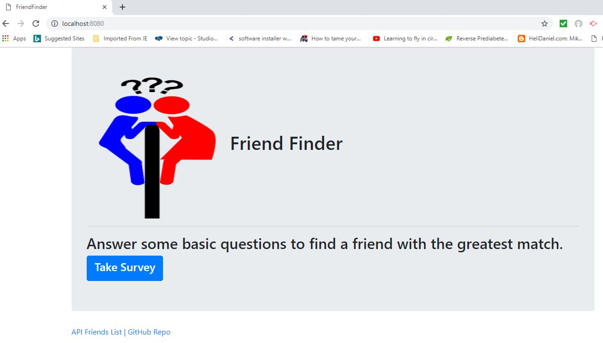
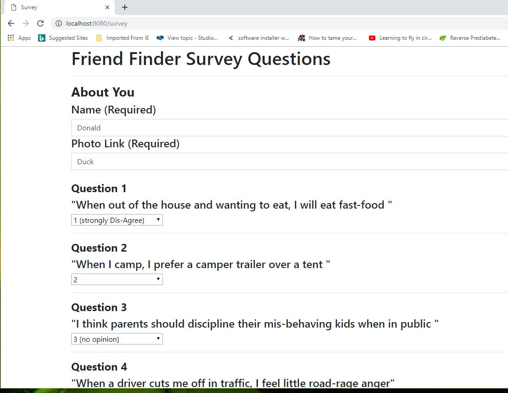
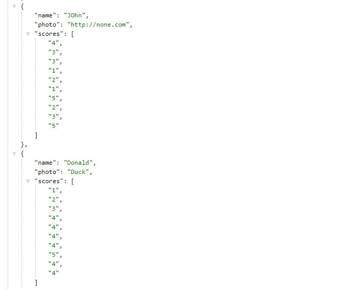
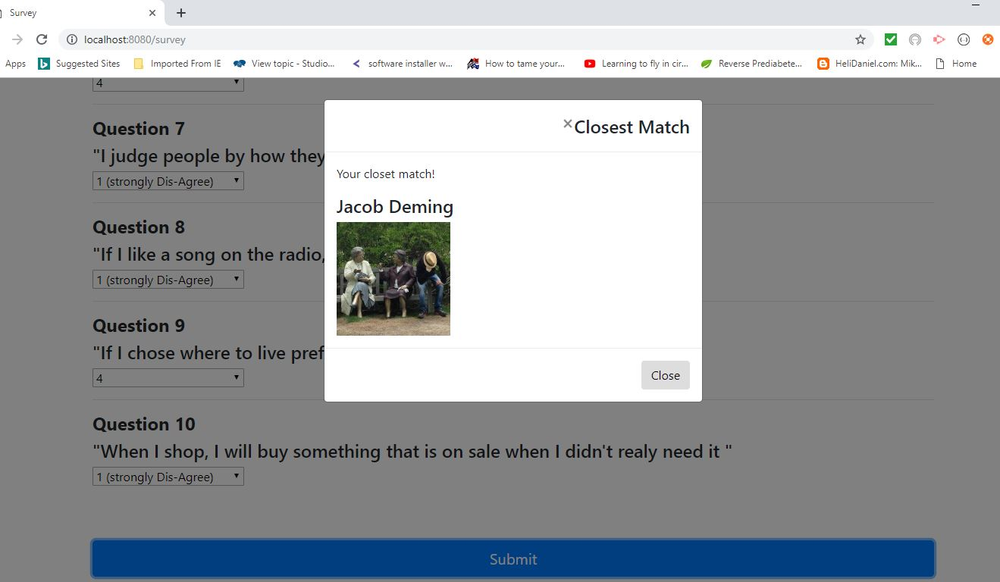
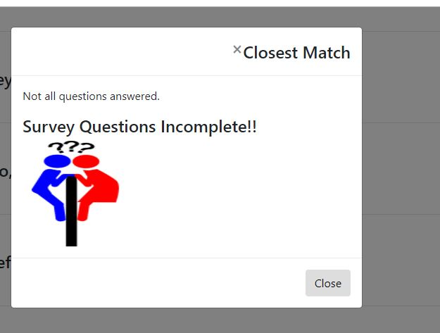
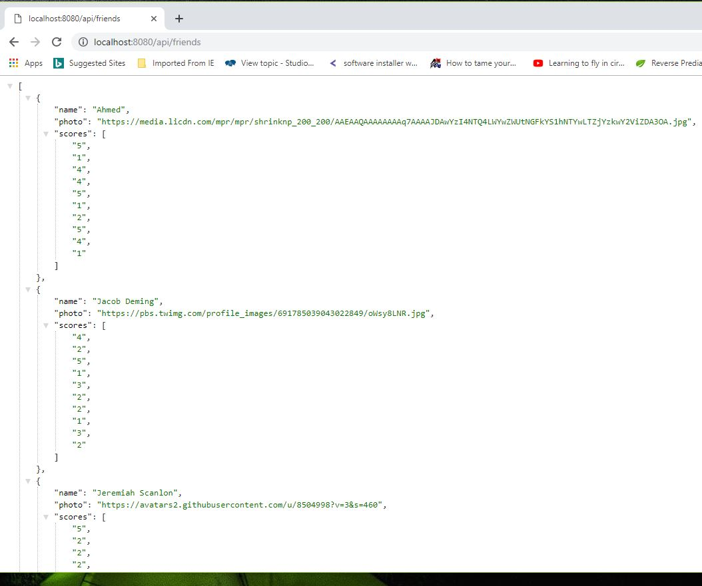
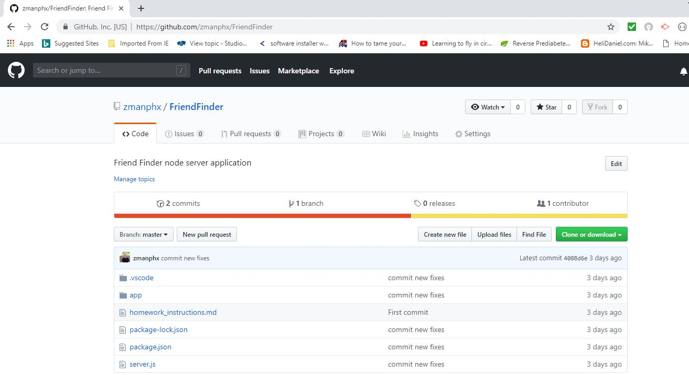

# Friend Finder

**Friend Finder** is a web browser  application  **node.js** node **express** to demonstrate back-end server routing.  The server routings are *api routes* and *html routes*.  

Friend Finder is hosted  at https://stormy-earth-78062.herokuapp.com/home.html . 

Connecting to the server at the default port of 8080 at the browser address shows the *home* page containing a button to take a survey.

 

Clicking on the  **Take Survey** button takes the user  to the survey html pages containing input box for user name and link to user photo . In addition, there are 10 questions with each question having a drop-down selector of values 1-5. 

 .

At the bottom of the survey page is a **submit button** . If all 10 questions are answered, a javascript **ajax post** is sent to the server to store the user information a long with their answers as a **JSON object**. 

 The logic calculates the closest match between the new  record submitted and records stored.  A modal window will show the match. 

If the submit button is clicked and not all questions are answered, a modal window will appear telling the user that not all questions are answered.

# HTML Links
 At the bottom of each html page are links to **API friends list** and **Git hub repository**. 

 Clicking on the link to the **API friends list** uses the api route rendering all the friends objects as  **JSON Objects** response from the server. 
 . 

 The link for  **Git hub repository** links the **Git hub**  code repository. 

  . 